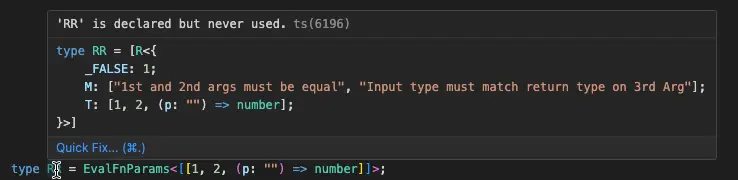
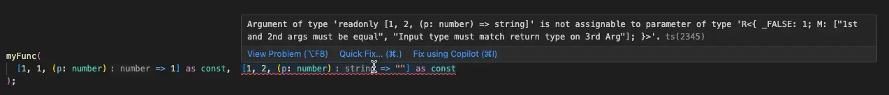

# ts-neverfalse

Automated error coalescing and aggregation to simplify advanced type evaluations in Typescript. It is primarliy intended for evaluations on functions and tuples





## How

Create validators by returning the original value or returning NEVER|FALSE

```ts
type validator<T> = T extends condition
  ? T
  : FALSE<T, "T does not meet condition">;
```

Use NEVER for redundant evaluations and other logical issues. NEVER errors and FALSE errors are both aggregated but FALSE supercedes NEVER, allowing only the most relevant issues to be propogated through typescript evaluations.

Use VALIDATE_ALL to join multiple validations.

```ts
type ValidateTuple<T> = VALIDATE_ALL<[ValidateA<T>, ValidateB<T>]>;
// concatenates errors from A and B into a single error object 
```

### install:

```bash
npm install -D ts-neverfalse
```

### import:

```ts
import { NEVER, FALSE, VALIDATE_ALL } from "ts-neverfalse";
import { IsError, IsNever, IsFalse, MergeError } from "ts-neverfalse/error";
import { INCLUDE_T } from "ts-neverfalse/config";
import { unique, R as resolve } from "ts-neverfalse/utils";
```

### config:

When debugging it is useful to see the type as it was when evaluated. For readability, this is disabled by default. To includeT, add the following anywhere in your TS application:

```ts
declare global {
  namespace NeverFalse {
    interface Config {
      includeT: true;
    }
  }
}
```

### tips:
Especially when working with tuples, it is important to prevent TS's type reductions. Ask your chatbot about the following concepts:
```
* tuples as const
* readonly typescript inputs
* extends readonly 
```
The expectType in [TSD - TypeScript Definition manager](https://github.com/DefinitelyTyped/tsd) is very useful for verifying complex validators. Example in [index.test-d.ts]https://github.com/Macioa/ts-neverfalse/blob/main/test/index.test-d.ts)